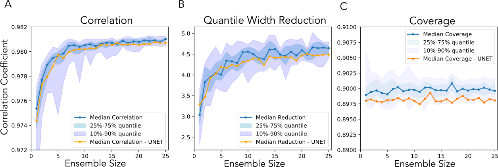
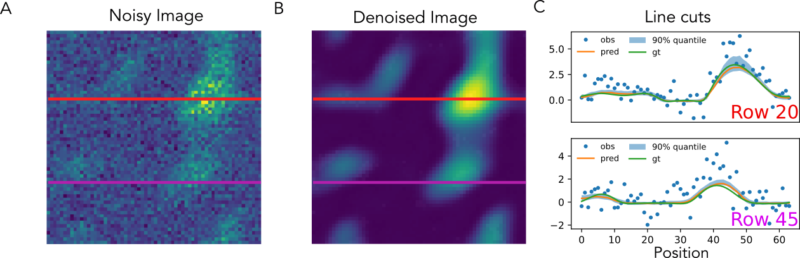
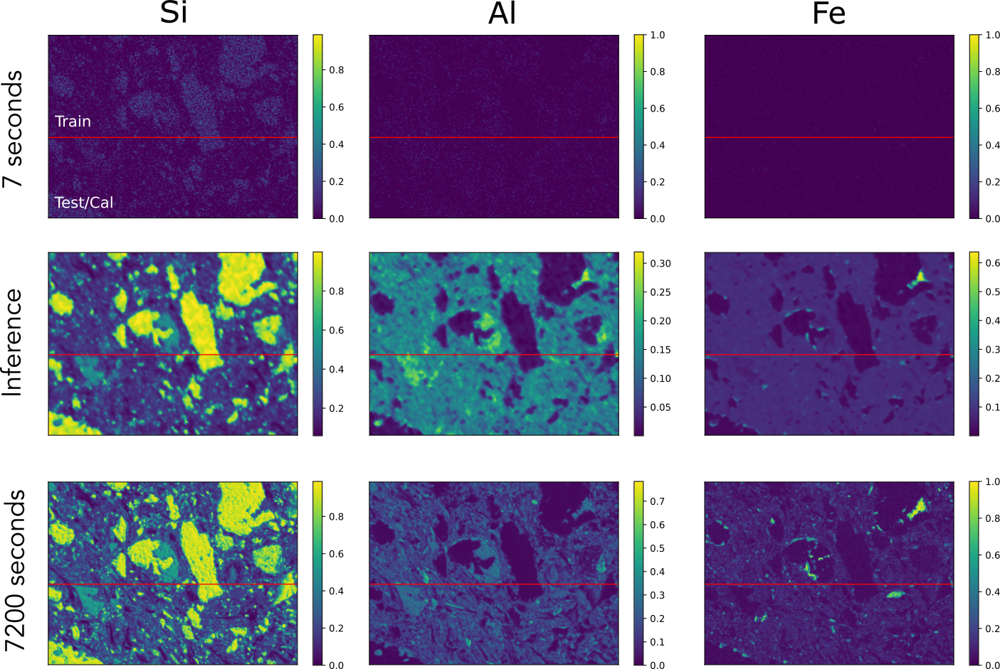
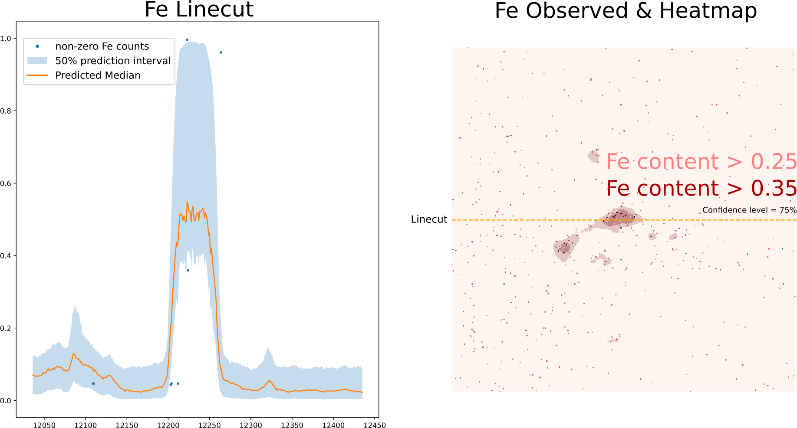
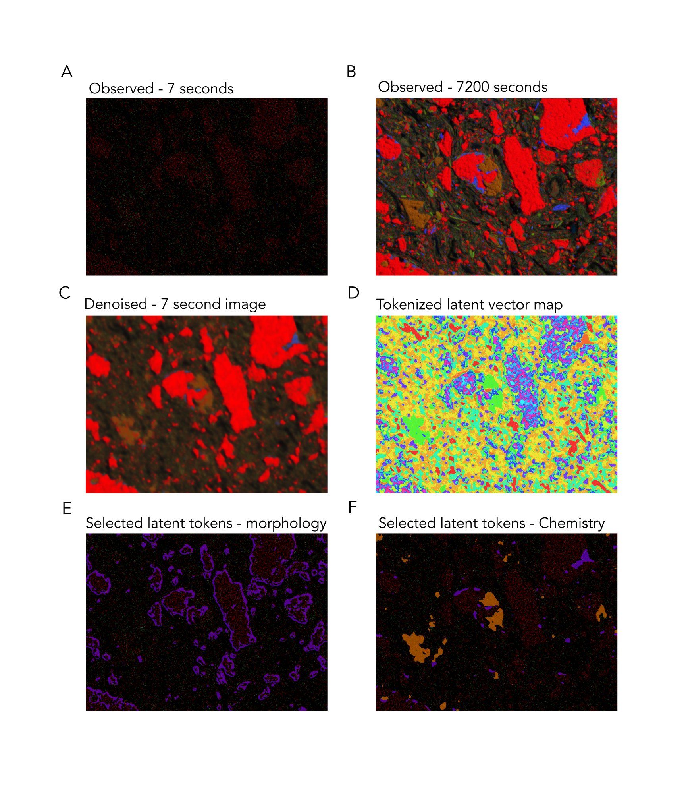
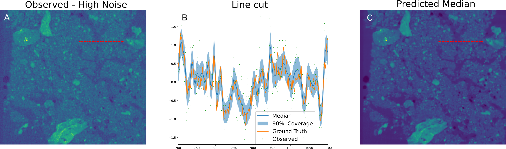
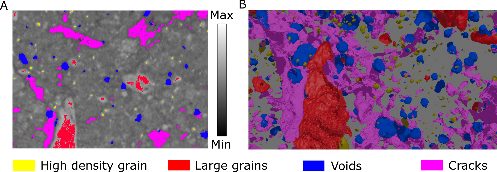

# Behind the Noise  
**Conformal Quantile Regression Drives Emergent Representations**

Our approach uses ensembles of small, randomly-generated neural networks to denoise scientific images, quantify prediction uncertainty, and reveal hidden structures in the data—all without any hand-labeled annotations.
A more detailed description is available [here](https://arxiv.org/abs/2505.08176).

---

## Abstract

Scientific imaging often requires long exposures to capture clear signals. We propose a new method that:

- **Denoises low-exposure images** by predicting lower, median, and upper quantiles.  
- **Calibrates uncertainty** with conformalized quantile regression for reliable coverage guarantees.  
- **Discovers latent structure** by clustering ensemble outputs into interpretable segments without supervision.

---

## Workflow

We generate compact networks using a stochastic architecture generator. These nets are shallow, parameter-efficient, and use dilated convolutions to cover multiple scales. Typically, only the depth needs tuning, with further refinements to balance memory and complexity.

  
*Figure 1: Examples of random networks and their performance on synthetic data.*

Each network has two parts: a convolutional encoder that maps each pixel to a latent vector (Figure 1-A) and three decoder heads that predict lower, median, and upper quantiles. Figure 1-B shows how performance varies across hyperparameters.

After selecting preferred hyperparameters, we build an ensemble and average their quantile outputs:

  
*Figure 2: Averaged quantile estimates from 20 random-network ensembles.*

Even with careful training, predicted intervals must be calibrated to achieve nominal coverage (e.g., 90%). We use [conformalized quantile regression](https://arxiv.org/abs/1905.03222) for this step.

Below is a sample of denoising results with asymmetric, heteroskedastic noise:

  
*Figure 3: Denoising synthetic data with asymmetric, heteroskedastic noise.*

---

## Applications

### SEM-EDX

Scanning Electron Microscopy coupled with Energy Dispersive X-ray Spectroscopy (SEM-EDX) gives us detailed, qualitative maps of a material’s elemental makeup. The downside? Getting both high resolution and low noise often means very long scan times. In this study, we ask whether a denoiser trained on just a handful of images can recover large-area SEM-EDX maps that would normally take weeks to record at good signal-to-noise. We start on a small patch: one “noisy” scan collected in 7 seconds and a “clean” reference scan collected over 2 hours. Each image has three channels—Si, Al, and Fe—and our training set consists of ten 7-second noisy scans plus that single 2-hour low-noise scan of the same region.

  
*Figure 4: SEM-EDX training data.*

The denoising is of course not as detailed as the 2 hour image, but we can get a good idea of what is going on. On unseen samples, denoising yields clear material contrasts:

  
*Figure 5: Denoising SEM-EDX results on unseen data.*

Inspecting the predicted quantile levels for the Fe channel, allows us to make good estimates of where potential, regions of interest are to re-measure at longer count rates. 
  

It turns out that when we cluster the ensemble latent vectors of our networks, we uncover meaningful classes:

  
*Figure 7: Latent clusters from SEM-EDX data.*

Without providing hand-drawn labels, the network produces latent vectors that can be functionally grouped into morphological and chemical groupings. 

### X-ray Computed Tomography

Our approach also works on 3D XCT volumes. Here we denoise a fast collected dataset given one that was collected at lower throughput, with more frames. We use 3D variants of the networks used above, to make sure that we can fully utilize the 3D nature of the data.

  
*Figure 6: Denoising 3D XCT data.*

Again, when we cluster our latent vectors, we highlights structural features, such as crack, voids, and larger grains:

  
*Figure 8: Latent clusters from XCT data.*

---

## Conclusions

What began as a simple denoising tool has revealed a much richer story: by cleaning up noisy images we don’t just recover clearer signals—we uncover hidden, semantic structure in the data. The calibrated denoising we demonstrate can guide more efficient experimental designs, while the emergent clusters in latent space point to where manual annotations or downstream analyses should focus.  

For a deeper dive into methods and results please see the [full paper](https://arxiv.org/abs/2505.08176).  

## Datasets

- [Synthetic data](https://huggingface.co/datasets/phzwart/BTN_Synthetic)  
- [X-ray CT of soil](https://huggingface.co/datasets/phzwart/BTN_XCT)  
- [SEM-EDX of soil](https://huggingface.co/datasets/phzwart/BTN_SEM-EDX)  

---

## Code

This research builds on our core libraries:

- [DLSIA (Deep Learning for Scientific Imaging & Automation)](https://github.com/phzwart/dlsia)  
- [qlty (Tensor chunking & stitching for PyTorch)](https://github.com/phzwatr/qlty)  
